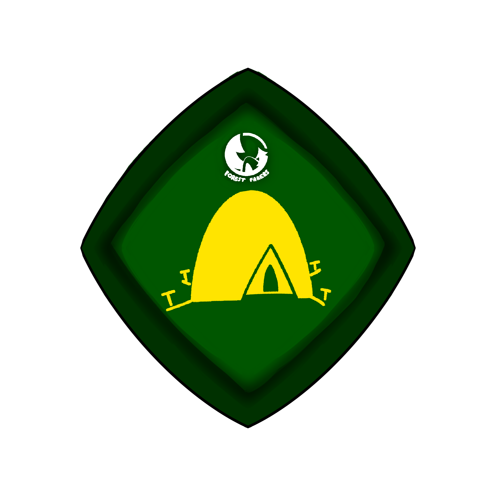
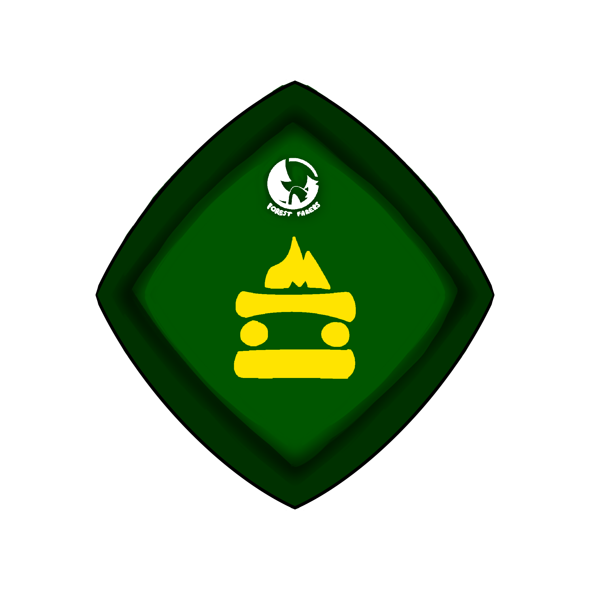
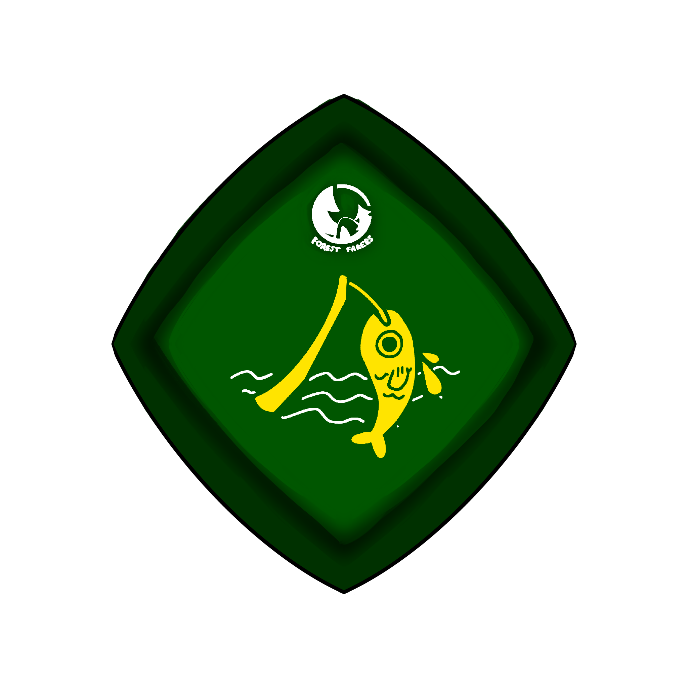

# Forest Farers
## By SmthCheesy Studios
</img>

## Overview
Forest Farers is an Educational game focused on teaching children survival skills to survive in the wilderness. 
## Recommended System requirements
Headset: Meta Quest 2
Storage: 450mb available space
Input: Quest Touch controllers required
Play Area: Standing play recommended (minimum 1.5m x 1.5m)
Internet: required (account services required to play)
## Walkthrough
### </img> Camper Badge
The camper badge is achieved by pitching a tent
- Throw down the orange tent bag in a clear open area
- Take the pegs and peg down the corners of the tent

|Badge   |Criteria | Score multiplier |
| -------- | ------- |  ------- |
|  Gold| All pegs driven down 3 times each (Total 12) | 2x |
| Silver | All pegs driven down 2-3 times each (Total 8+) | 1.5x |
| Bronze |Tent pitched| 1x |
### </img> Backwoodsman Badge
The Backwoodsman badge is achieved by making a campfire
- Pick up logs
- Place logs in the campfire area
- Once 4 Large and 4 Small logs are placed, the campfire is complete
<i>If wet logs are used, the player will be limited to only the bronze badge</i>

|Badge   |Criteria | Score multiplier |
| -------- | ------- |  ------- |
|  Gold| Campfire made before night| 2x |
| Silver | Campfire completed without wet logs| 1.5x |
| Bronze |Campfire completed with wet logs| 1x |

### </img> Angler Badge
The Angler badge is achieved by catching a fish at the waterfall
- Swing the fishing rod forward to cast the bobber
- Wait for the fish to bite
- Swing the fishing rod backwards to reel it back before the fish escapes
<i>If the fish escapes, the player will be limited to only the bronze badge</i>

|Badge   |Criteria | Score multiplier |
| -------- | ------- |  ------- |
|  Gold| Fish caught withing 1 second of biting| 2x |
| Silver |Fish caught withing 4 seconds of biting| 1.5x |
| Bronze |Fish caught after one has escaped| 1x |

### </img> Cook Badge
The Cook Badge is achieved by cooking the fish over the campfire
- Attach the fish to the cooking stick provided at the campsite
- Hold the fish over the fire
- Remove the fish when the meter reaches the green area

|Badge   |Criteria | Score multiplier |
| -------- | ------- |  ------- |
|  Gold| Fish is taken off the fire when the meter is in the green area| 2x |
| Silver |Fish is overcooked (Past the green area)| 1.5x |
| Bronze |Fish is burnt (Meter is fully full)| 1x |

## Bugs and Limitations
- If twisted and swung frantically, the fishing rod may break permenantly, being made unable to be cast
- Anti Motion Sickness mode pulses unpredictably when deployed onto the headset
- Book UI is unpredictable, sometimes not being affected by the XR Controller Pokes

## Smth Cheesy - Team Members
</img>  
<b> Lim En Xu, Jayson </b> (Team Lead and Lead Unity Programmer)  
<b> Emilie Tee Jing Hui </b>(Lead Graphic Designer and 3D Modeller)  
<b> Katriel Wong Shu Ning </b> (Environment Designer and Game Designer) 
<b> Andre Lim Zhe Kai </b> (Lead Web Developer) 
## Credits
### Art and Assets
UI Kit - <a href="https://assetstore.unity.com/packages/2d/gui/buttons-set-211824">Buttons Set</a> by <a href="https://assetstore.unity.com/publishers/53314">KartInnka</a>
Trees - <a href="https://assetstore.unity.com/packages/3d/environments/landscapes/low-poly-simple-nature-pack-162153">Low-Poly Simple Nature Pack</a> by <a href="https://assetstore.unity.com/publishers/44390">JustCreate</a>
Day and Night Skyboxes - <a href="https://assetstore.unity.com/packages/2d/textures-materials/sky/qms-cartoon-skybox-pack-free-301624">QMS - Cartoon Skybox Pack</a> by <a href="https://assetstore.unity.com/publishers/99259">Quantam Mana Studio</a>
### Shaders
Crossfade Shader - <a href="https://guidohenkel.com/2013/04/a-simple-cross-fade-shader-for-unity/">A Simple Cross Fade Shader</a> by <a href="https://guidohenkel.com/">
Guido Henkel</a>

### Audio
Waterfall - waterfall by <a href="https://pixabay.com/users/freesound_community-46691455/">freesound_community</a> from <a href="https://pixabay.com/music//?utm_source=link-attribution&utm_medium=referral&utm_campaign=music&utm_content=236133">Pixabay</a>  
Campfire - Campfire in the Woods by <a href="https://pixabay.com/users/dragon-studio-38165424/">DRAGON-STUDIO</a> from <a href="https://pixabay.com/music//?utm_source=link-attribution&utm_medium=referral&utm_campaign=music&utm_content=236133">Pixabay</a> 
Wind - Soft Wind by <a href="https://pixabay.com/users/storegraphic-49061086/">storegraphic</a> from <a href="https://pixabay.com/music//?utm_source=link-attribution&utm_medium=referral&utm_campaign=music&utm_content=236133">Pixabay</a> 
Sticks - Sticks Hitting sticks by <a href="https://pixabay.com/users/freesound_community-46691455/">freesound_community</a> from <a href="https://pixabay.com/music//?utm_source=link-attribution&utm_medium=referral&utm_campaign=music&utm_content=236133">Pixabay</a> 
Fishing rod - Simple Whoosh by <a href="https://pixabay.com/users/dragon-studio-38165424/">DRAGON-STUDIO</a> from <a href="https://pixabay.com/music//?utm_source=link-attribution&utm_medium=referral&utm_campaign=music&utm_content=236133">Pixabay</a> 
Water Splash - Water splash by <a href="https://pixabay.com/users/freesound_community-46691455/">freesound_community</a> from <a href="https://pixabay.com/music//?utm_source=link-attribution&utm_medium=referral&utm_campaign=music&utm_content=236133">Pixabay</a> 
Reeling sound - Fly Reel Fish Pulling Saricione by <a href="https://pixabay.com/users/freesound_community-46691455/">freesound_community</a> from <a href="https://pixabay.com/music//?utm_source=link-attribution&utm_medium=referral&utm_campaign=music&utm_content=236133">Pixabay</a> 
Mallet sound - Hammer Steel Impact by <a href="https://pixabay.com/users/universfield-28281460/">Universfield</a> from <a href="https://pixabay.com/music//?utm_source=link-attribution&utm_medium=referral&utm_campaign=music&utm_content=236133">Pixabay</a> 
Doorbell - Vintage Doorbell Ring Sound Effect by <a href="https://pixabay.com/users/waltermidnight-49207772/">WalterMidnight</a> from <a href="https://pixabay.com/music//?utm_source=link-attribution&utm_medium=referral&utm_campaign=music&utm_content=236133">Pixabay</a> 
Book - Turn A Page by <a href="https://pixabay.com/users/creatorshome-49707711/">CreatorsHome</a> from <a href="https://pixabay.com/music//?utm_source=link-attribution&utm_medium=referral&utm_campaign=music&utm_content=236133">Pixabay</a>

### Libraries
Firebase Database  
Firebase Auth
